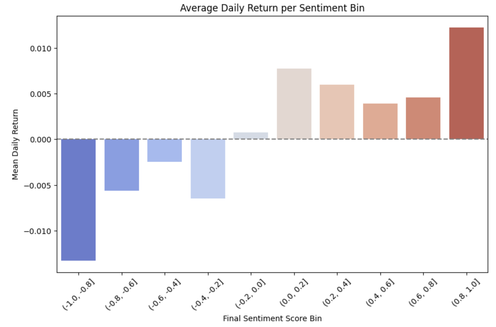
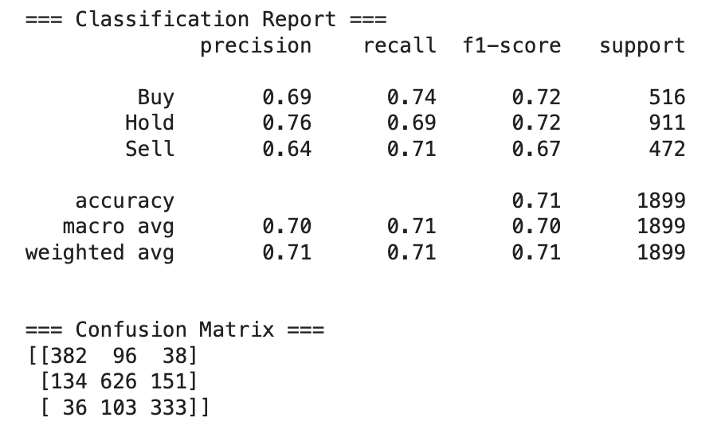
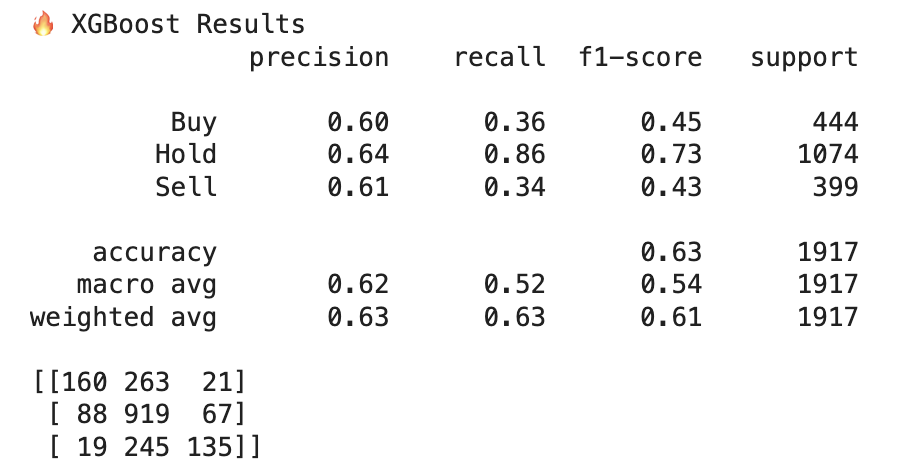
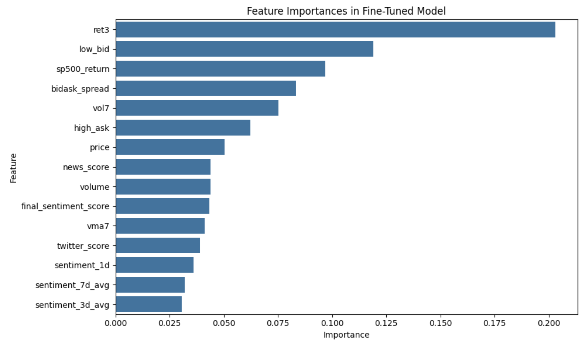
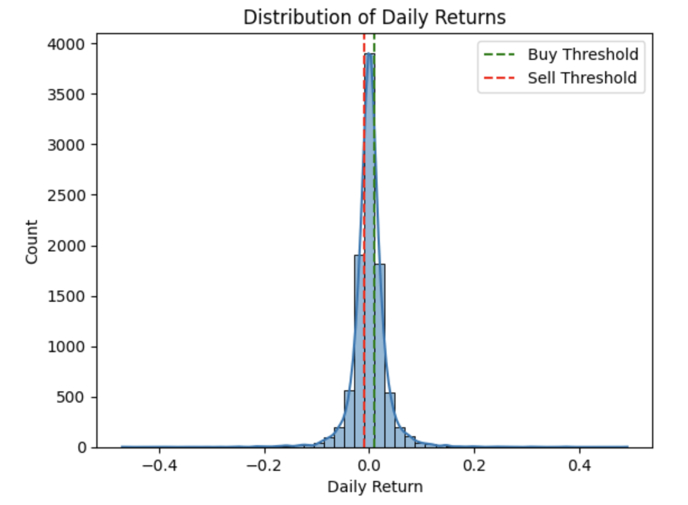
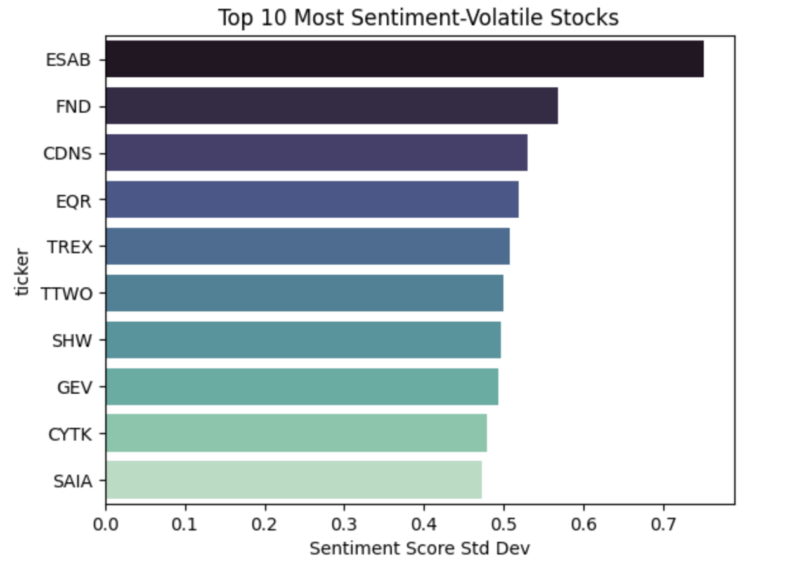

# FinancialScorePredictor_UsingSentimentAnalysis
A full-fledged machine learning pipeline to predict Buy / Hold / Sell signals for S&P 500 stocks using sentiment analysis on Twitter & News articles, historical stock performance, and engineered financial indicators. Stock Sentiment-Based Action Predictor

The data is engineered for S&P 500 stocks. The number of unique stocks covered by the model is: 456

## **Project Summary :**

This project builds a predictive model that: 
1) Ingests Twitter and News data to compute sentiment scores
2) Merges it with structured stock data and financial indicators
3) Applies lag-based sentiment aggregation
4) Trains a model to classify stock actions as Buy, Hold, or Sell

### **Goal:** Provide users with a daily stock strength signal powered by sentiment fluctuations and market data.

## **Data Sources & Engineering**

### **Sentiment Data:**
1) Twitter: Analyzed using cardiffnlp/twitter-roberta-base-sentiment
2) News: Analyzed using yiyanghkust/finbert-tone

Each row contains: news_score, twitter_score, Weighted final score: 0.65 * news + 0.35 * twitter

### **Stock Data:** Includes features like: price, volume, low_bid, high_ask, sp500_return
Engineered Features: ret3: 3-day cumulative return, vol7: 7-day volatility (std), vma7: 7-day average volume, bidask_spread: spread between ask and bid prices
sentiment_3d_avg, sentiment_7d_avg: rolling sentiment windows

## **Modeling Approach**

Final Model (71% accuracy): XGBoost (Bayesian Optimized) - Applied SMOTETomek to balance class imbalance, Tuned with Bayesian Search (skopt)

Performance after optimizing:

Significantly improved over baseline (63%) and unbalanced recall values 

Interpretability, Feature Importance tracked, Sentiment-based features giving about 20% variation in the predictions.

## **Sample Predictions**

Preview of model predictions:

| Ticker | Price   | Final Sentiment | Sentiment 3D Avg | Sentiment 7D Avg | Ret3   | Vol7   | Actual Action | Predicted Action |
|--------|---------|------------------|------------------|------------------|--------|--------|----------------|-------------------|
| ORCL   | 77.08   | -0.323           | 0.019            | -0.108           | 0.026  | 0.011  | Buy            | Buy               |
| ORCL   | 102.34  | 0.324            | 0.188            | 0.222            | 0.044  | 0.009  | Buy            | Buy               |
| MSFT   | 337.20  | -0.216           | -0.138           | -0.500           | 0.000  | 0.007  | Buy            | Buy               |
| MSFT   | 355.08  | 0.521            | -0.013           | 0.148            | 0.029  | 0.002  | Sell           | Buy               |
| MSFT   | 328.41  | -0.650           | 0.025            | -0.217           | 0.004  | 0.015  | Buy            | Buy               |
| WM     | 141.77  | 0.130            | -0.007           | 0.012            | -0.015 | -0.004 | Hold           | Hold              |
| GE     | 100.15  | 0.650            | 0.436            | 0.542            | 0.019  | 0.001  | Hold           | Hold              |
| CHTR   | 394.41  | -0.650           | -0.130           | -0.217           | -0.227 | 0.002  | Sell           | Sell              |
| IBM    | 145.89  | 0.632            | 0.185            | 0.324            | 0.004  | 0.004  | Hold           | Hold              |
| APO    | 67.00   | -0.604           | 0.062            | -0.093           | -0.001 | -0.011 | Hold           | Hold              |
| META   | 118.10  | 0.078            | 0.084            | 0.136            | -0.223 | 0.031  | Buy            | Buy               |

See data/Actual_vs_Predictions.csv for 100 randomly sampled tickers with actual vs. predicted results.

## **Visual Gallery**

Creators: Harsh Shah, Ishanay Sharma, Saketh Bollina
